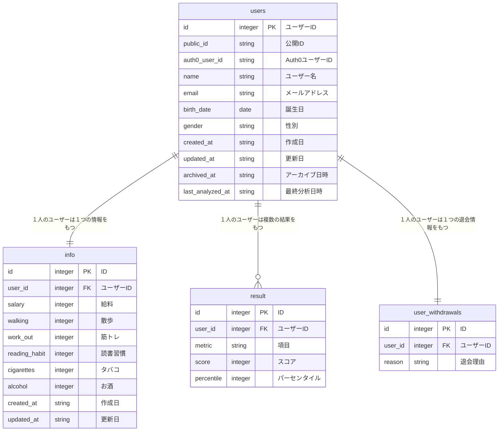

# Social Graph

## サービス概要

ユーザーデータをもとに、社会的な位置を可視化するサービスです。<br>
統計学とAIを活用し、ユーザーの行動データを直感的なグラフで可視化。
日々のライフスタイルや習慣の項目を入力することで確認することができます。

## 技術スタック

- **Backend/Frontend**: Next.js, TypeScript
- **UI**: Mantine, Tailwind CSS
- **Authentication**: Auth0
- **Validation/Env**: Zod, @t3-oss/env-nextjs
- **Database/ORM**: MySQL, Prisma
- **Deployment**: Vercel
- **CI/CD**: GitHub Actions (lint, migrate)
- **AI**: OpenAI

## 改善予定の箇所・機能
- 追加機能
	- 目標設定: 週/月の目標で達成バッジを付与
	- セルフチェックの推移グラフ/達成率で継続促進
	- リマインダー: 定期的に通知を送ることでセルフチェックを継続させ、推移（成長率）を可視化して改善につなげる
- パフォーマンス改善
	- 集計/結果計算の処理負荷を削減（キャッシュ化・差分更新）

## サイトURL

URLは[こちら](social-app-phi-jet.vercel.app)

## データベーススキーマ



## ユーザーフロー

1. 会員登録
2. 個人情報の入力・更新
3. スコア算出とグラフ表示
4. SNS共有
5. AI分析

## 入力項目
- ユーザー登録
	- ユーザー名
	- 生年月日
	- 性別
- セルフチェック診断
	- 年収
	- 散歩
	- 筋トレ
	- 飲酒
	- 喫煙
	- 読書習慣
- 退会処理
	- 理由

## 画面構成

- 会員登録画面
- セルフチェック画面
- 待機画面
- ダッシュボード画面
- AI分析画面
- 退会画面

## 必要な環境

- docker
- mise

プロジェクトのルートディレクトリで以下のコマンドを実行することによって必要なツールをインストールすることができます。

```bash
brew install mise

mise install
```