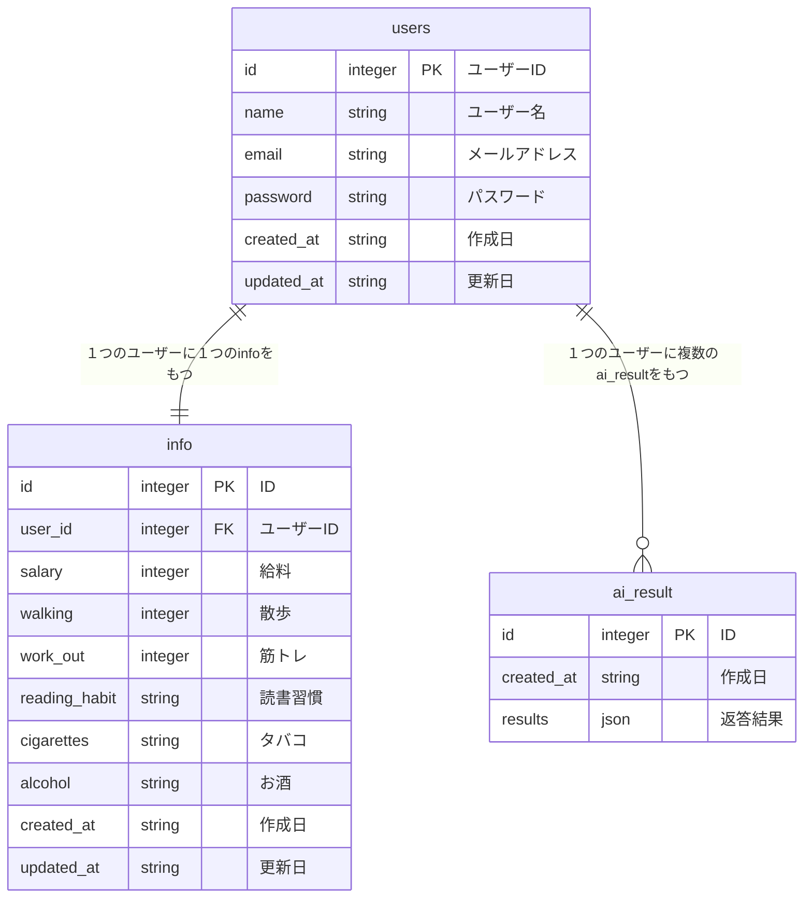

# social-app

ユーザーデータをもとに、社会的な位置を可視化するWebアプリケーション。

## 概要

統計学とAIの知見を活用し、ユーザーの行動データを直感的なグラフで可視化。

## 必要な環境

- docker
- mise

プロジェクトのルートディレクトリで以下のコマンドを実行することによって必要なツールをインストールすることができます。

```bash
brew install mise

mise install
```

### 主な機能

- セルフチェック機能
- 登録機能
- 統計でグラフ表示
- SNS共有機能
- AI分析機能
- 退会機能

## 技術スタック

- **Backend/Frontend**: Next.js/TypeScript
- **Database**: MySQL
- **Deployment**: Vercel

## セットアップ

```bash

```

ブラウザで http://localhost:3000 を開く

## データベーススキーマ



## ユーザーフロー

1. 会員登録
2. メイン画面（初期ベンチマーク可視化）
3. 個人情報の入力・更新
4. スコア算出とグラフ表示
5. SNS共有
6. AI分析

## 入力項目

- 年収
- 散歩
- 筋トレ
- 読書習慣
- 飲酒
- 喫煙

## 画面構成

- 会員登録画面
- セルフチェック画面
- 待機画面
- ダッシュボード画面
- AI分析画面
- 退会画面

