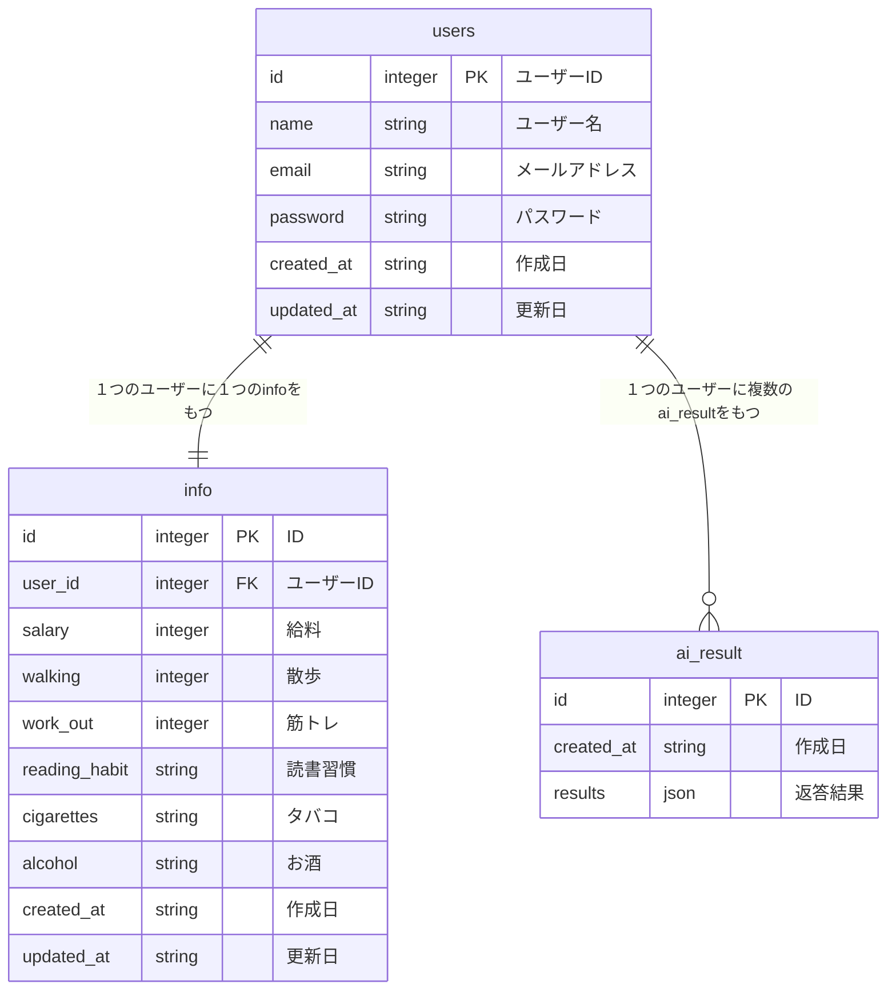

# social-app

ユーザーの自己データとSNS公開データをもとに、他者との「心理的距離」や社会的ベンチマークを可視化するWebアプリケーション。

## 概要

社会的比較理論と行動経済学の知見を活用し、ユーザーの行動データを直感的なグラフで可視化。SNS共有機能により、継続的な行動変容を促進します。

## 必要な環境

- docker
- mise

プロジェクトのルートディレクトリで以下のコマンドを実行することによって必要なツールをインストールすることができます。

```bash
brew install mise

mise install
```

### 主な機能

- 個人データ入力と社会的ベンチマークの可視化
- 心理的距離の直感的なグラフ表示
- SNS共有機能
- 行動経済学に基づいた介入設計

### 理論的背景

- 社会的比較理論
- 参照点依存性
- 損失回避とコミットメントデバイス

## 技術スタック

- **Backend/Frontend**: Next.js/TypeScript
- **Database**: MySQL
- **Deployment**: Vercel

## セットアップ

```bash

```

ブラウザで http://localhost:3000 を開く

## データベーススキーマ



## ユーザーフロー

1. 会員登録
2. メイン画面（初期ベンチマーク可視化）
3. 個人情報の入力・更新
4. スコア算出とグラフ表示
5. SNS共有

## 入力項目

- 年収
- 運動習慣（散歩、筋トレ）
- 読書習慣
- 飲酒・喫煙

## 画面構成

- 会員登録画面
- 個人情報入力画面
- メイン画面（可視化ダッシュボード）

